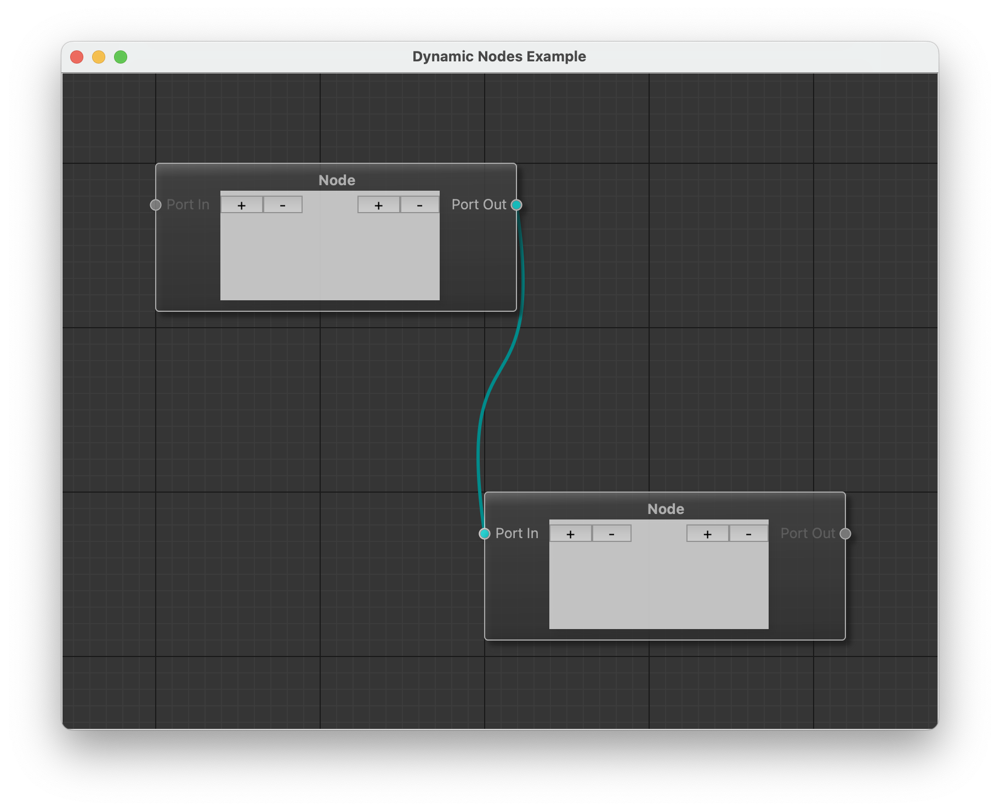

# SpatialNode

## Introduction

**SpatialNode** is conceived as a general-purpose Qt-based library aimed at
developing Node Editors for various applications. The library could be used for
simple graph visualization and editing or extended further for using the
[Dataflow paradigm](https://en.wikipedia.org/wiki/Dataflow_programming) .

The library is written using the Model-View approach. The whole graph structure
is defined by a class derived from ``AbstractGraphModel``. It is possible to
create or add Nodes and Connections. The underlying data structures could be of
any arbitrary type or representation.

An instance of ``AbstractGraphModel`` could or could not be attached to
specialized ``QGraphicsScene`` and ``QGraphicsView`` objects. I.e. the so-called
"headless" `modus operandi` is possible.

## Data Flow Paradigm

The extended model class ``DataFlowGraphModel`` allows to register "processing
algorithms" represented by nodes and is equipped with a set of Qt's signals and
slots for propagating the data though the nodes.

The node's algorithm is triggered upon arriving of any new input data. The
computed result is propagated to the output connections. Each new connection
fetches available data and propagates is further. Each change in the source node
is immediately propagated through all the connections updating the whole graph.

## Acknowledge

This project is forked form [nodeeditor](https://github.com/paceholder/nodeeditor) originally but rewrite to pure python
project, which can integrate with python package well.